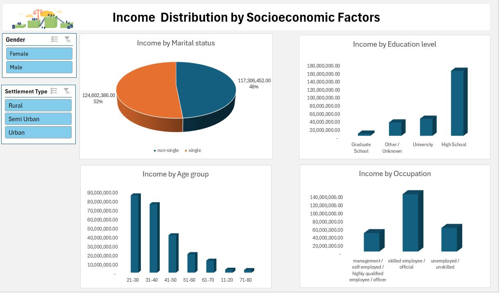

# Project 1

**Title:** [Income Distribution by Socioeconomic Factors](https://github.com/Bolustic/boluwatife.github.io/blob/main/Socioeconomic%20Factors%20and%20Income%20Dataset.xlsx)

**Dashboard Overview:**

**Tools Used:** Microsoft Excel (Pivot Chart, Pivot Table, Conditional Formatting, Slicer)

**Project Description:** 

This dataset contains demographic and socioeconomic information for 2000 individuals, including attributes such as age, education level, occupation, income, and settlement size. It is ideal for studies related to income distribution, employment trends, and socioeconomic factors influencing financial status.

The dataset includes the following columns:
ID: Unique identifier for each individual
Sex: Encoded as 0 (Female) and 1 (Male)
Marital Status: Categorized as single or non-single (divorced/separated/married/widowed)
Age: Age of the individual
Education: Education level attained (e.g., high school, university)
Income: Annual income in monetary units
Occupation: Job classification (e.g., skilled employee, unemployed)
Settlement Size: Categorization of the residential area (possibly urban/rural classification)

**Key findings:** 
Income Prediction: Understanding how factors such as education, marital status, age group, and occupation impact earnings. 
Demographic & Socioeconomic Analysis: Exploring relationships between gender, settlement type, and economic well-being

# Project 2

**Title:** Employee Queries, Interrogation, and Manipulation <1>

**SQL Code:** [Employee SQL Code](https://github.com/Bolustic/boluwatife.github.io/blob/main/Employee.SQL)

**SQL Skills Used:**
Data Retrieval (SELECT): Queried and extracted specific information from the database.
Data Aggregation (SUM, COUNT): Calculated totals, such as sales and quantities, and counted records to analyze data trends.
Data Filtering (WHERE, BETWEEN, IN, AND): Applied filters to select relevant data, including filtering by ranges and lists.
Data Source Specification (FROM): Specified the tables used as data sources for retrieval

**Project Description:**
This project focuses on analyzing a comprehensive dataset containing detailed information about employees. The primary objective is to utilize SQL to extract meaningful insights regarding employee information, their department, projects worked on, salary, and other relevant attributes.

Database Design and Implementation: Develop a relational database schema to effectively store and manage the Employee data, ensuring normalization and referential integrity.

Data Analysis Using SQL: Execute SQL queries to analyze various aspects of the dataset, including: Employee salary, Departments, Location, Bonus estimation, etc.

Insight Extraction: Identify patterns and trends within the data, such as: Employees with the highest salary, their distribution across locations, the projects they embark upon, and possible bonus distribution

Reporting and Visualization: Present the findings through comprehensive reports and visualizations to facilitate better understanding and decision-making. By the end of this project, we aim to have a fully functional SQL database capable of providing in-depth analysis of employees' data, offering valuable insights such as staffing needs for management. 
 
**Technology used:** SQL server

# Project 3

**Title:** Employee Queries, Interrogation, and Manipulation <2>

**SQL Code:** [Employee_2 SQL Code](https://github.com/Bolustic/boluwatife.github.io/blob/main/Employee_2.SQL)

**SQL Skills Used:**
Data Retrieval (SELECT): Queried and extracted specific information from the database.
Data Aggregation (SUM, COUNT): Calculated totals, such as sales and quantities, and counted records to analyze data trends.
Data Filtering (WHERE, BETWEEN, IN, AND): Applied filters to select relevant data, including filtering by ranges and lists.
Data Joins (JOIN, LEFT JOIN): Wrote queries to create a new table that consists of data and structure copied from another table
Data Source Specification (FROM): Specified the tables used as data sources for retrieval

**Project Description:**
This is a follow-up on project 2, and it focuses on analysing a comprehensive dataset containing detailed information about employees. The primary objective is to utilise SQL to extract meaningful insights regarding employee information, their department, date of joining, salary, and other relevant attributes.

Database Design and Implementation: Develop a relational database schema to effectively store and manage the Employee data, ensuring normalization and referential integrity.

Data Analysis Using SQL: Execute SQL queries to analyze various aspects of the dataset, including: Employee salary, Departments, Location, Position, etc.

Insight Extraction: Identify patterns and trends within the data, such as: Employees' salary distribution, their distribution across gender & locations, positions, and years spent in the company.

Reporting and Visualization: Present the findings through comprehensive reports and visualizations to facilitate better understanding and decision-making. By the end of this project, we aim to have a fully functional SQL database capable of providing in-depth analysis of employees' data, offering valuable insights such as staffing needs and continuity planning for management. 
 
**Technology used:** SQL server
